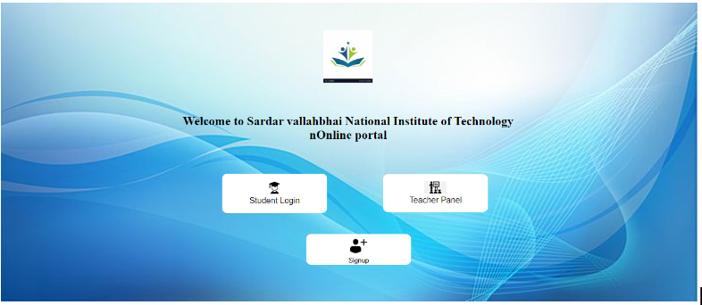
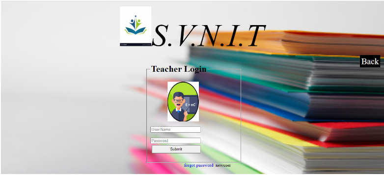
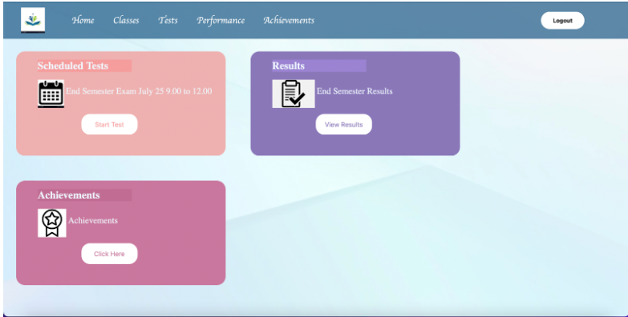
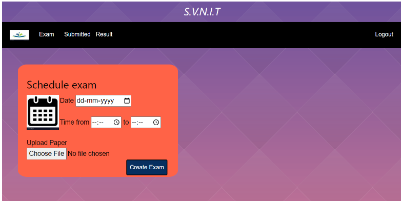

# Team:ARTEMIS
##                        Project
This is to certify that this project  “Examify”  is a bonafide record by the following group of S.V.N.I.T College.
Name 
Mohammad Ansah
S.Jaswanth Reddy 
K.Akshaya Pujitha

Mentor                                                                                     
Naidik Patil                                                 
Zaid Bhimala

## Problem Statement:Let’s Examify

The project titled Examify is exam software for conducting online semester exams for students. The project “Examify'' is developed in Django,html,which mainly focuses on basic operations in conducting online semester examinations and facililating the students to write  subjective mode online. 

The features of the websites are as follows:
Website contain homepage as shown below:

Where students , teachers can login separately or new users can sign up through clicking on the signup button.
Students ,teachers need to register themselves,and can login in their respective portals.

The login pages are shown below:

From  new users we collect  information which is useful for teachers to identify  them.The login pages give registered users access to their respective page.
After student login there page look like below:

Feature in student page are:
            1.They can view exam paper pdf
            2.They can submit their subjective answers in pdf
            3.They can see results
As it is a subjective exam students need to write accordingly and scan it and make relevant pdf. The submitted pdf will be displayed to the teacher. Students can view the pdfs of  exam paper,and the results that are uploaded by the teacher.  

## Teacher page:

Teacher page:

Teachers can schedule exams and upload question papers through the teacher portal and students can access question papers through the student portal.
Features of this  portal are:
  1.Teachers  can get student responses.
  2.Teachers  can upload the result pdf.
  3.Teachers  can upload the exam question paper pdf

Backend:
The server is hosted in a virtual environment  which is run on django.

https://docs.google.com/document/d/13-lUpu6G29rSOM4oRIBd7j86A0b3elZL1gOokL_S20U/edit?usp=sharing
